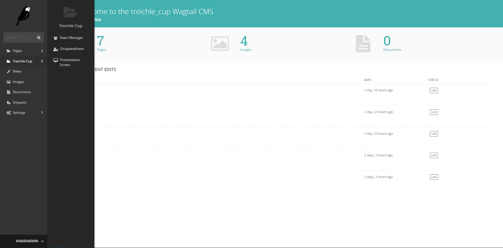
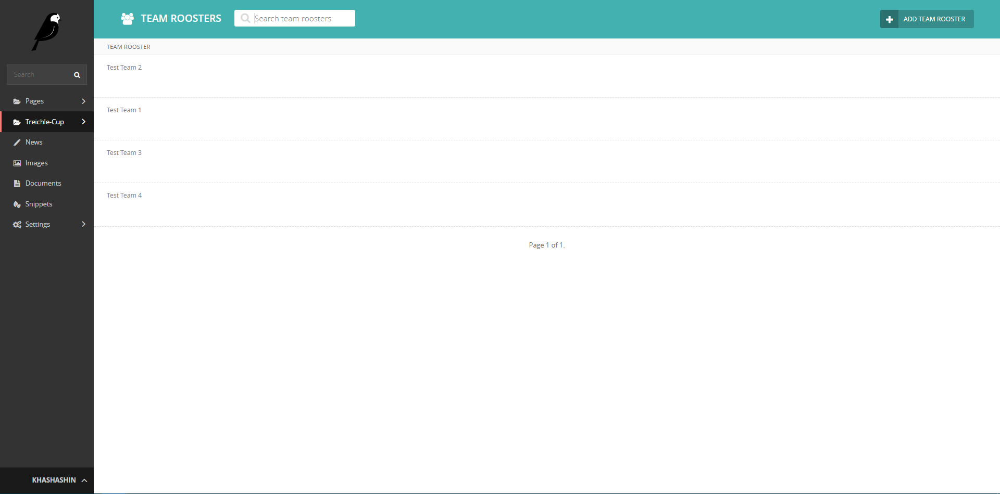
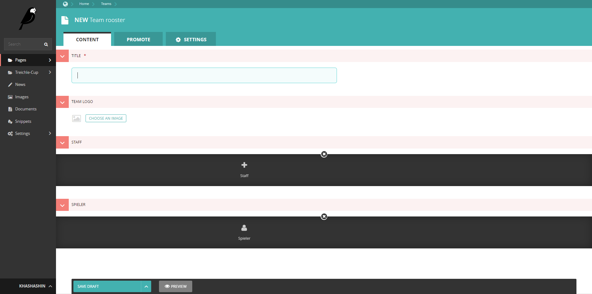
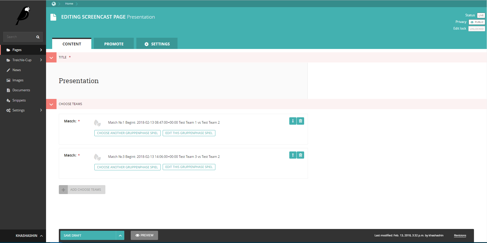
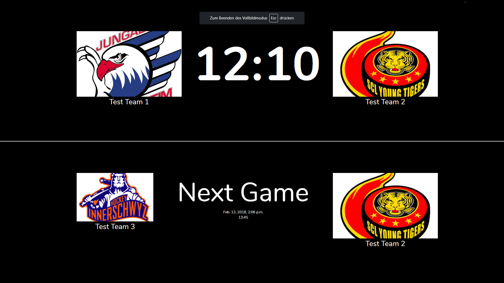

Treichle-Cup
=====================
**Tournament manager**

Simple and convenient manager of tournaments, games and teams based on [wagtail cms](wagtail.io).  
The project is still under development. Many things are not yet automated.

| | |
|-|-|
|||
|||

After creating the matches, you can create a presentation page to the current result on the big screen.

| | |
|-|-|
|||


**Backend setup**

Install Python 3
https://www.python.org/downloads/

And then

```
sudo apt-get install python3-venv

pyvenv env
. env/bin/activate
pip install -U pip
pip install -r requirements.txt
```

## Database setup

Once your installation is ready, you can get a blank database set up and add a user to login with.

Run these commands:

```
./manage.py migrate
./manage.py createsuperuser
```

You will be asked a few questions to create an administrator account.

After completing setup, you can use:

```
./manage.py runserver
```

Now access the admin panel with the user account you created earlier: http://localhost:8000/admin/
